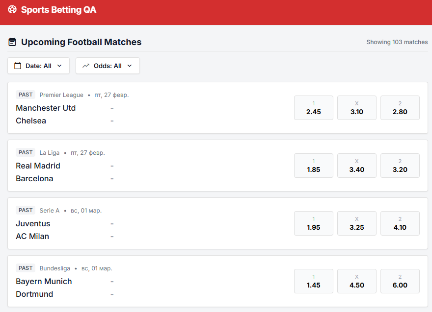
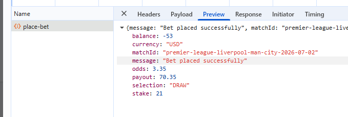
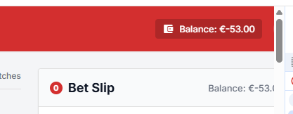
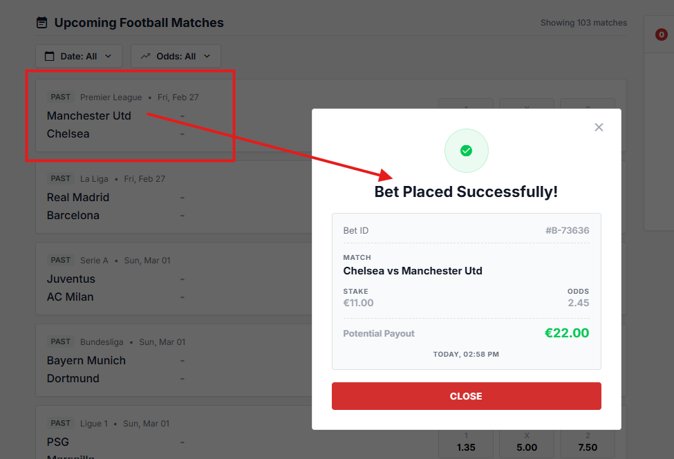

# Execution results:

| Test | Result | Related issue |
|:----:|:------:|:-------------:|
| T-01 |  Fail  |  B-01, B-02   |
| T-02 |  Fail  |     B-02      |
| T-03 |  Pass  |       -       |

## Bugs

### **Bug ID**: B-01  
**Title**: System displayed past matches at the beginning  
**Severity**: Medium  
**Business Impact**: This can highly confuse users, but we have a filtering functionality so severity lowered  
**Steps**:
- Precondition: Login as user with 100 euro on balance to application
- Go to the Upcoming Football Matches page
- Draw your attention to the match dates 

**Expected Result**: 
- Match list display upcoming football matches

**Actual Result**: 
- Past matches are displayed

### **Bug ID**: B-02  
**Title**: System does update balance and does not prevent from betting with insufficient balance  
**Severity**: Critical  
**Business Impact**: Incorrect calculations can lead to financial problems and loss of user trust  
**Steps**:
- Precondition: Login as user with 100 euro on balance to application
- Go to the Upcoming Football Matches page
- Click on random winner button for first available upcoming match
- Set value 100 into the stake field
- Hit Place bet button
- Close receipt
- Repeat steps couple times without page refresh

**Expected Result**: 
- After receipt is closed balance reflects current value and user is returned to main flow without active selection

**Actual Result**: 
- After receipt is closed balance is not updated
- User is able to go through bet cycle many times with insufficient balance (no check on back-end)
- Once page is refreshed - negative balance is displayed

### **Bug ID**: B-03  
**Title**: User is able to make a bet on the past match  
**Severity**: High  
**Business Impact**: This can highly confuse users and lead to additional effort for support and potentially financial issues  
**Steps**:
- Precondition: Login as user with 100 euro on balance to application
- Go to the Upcoming Football Matches page
- Click on random winner button for first available PAST match
- Set value 100 into the stake field
- Hit Place bet button

**Expected Result**: 
- Since there is no explicit requirement for this functionality - BA input required.
- Suggested option - disable all controls for PAST match (as separate feature can suggest to display results of past matches)
**Actual Result**: 
- User is able to place bet for past match as for any upcoming match
 